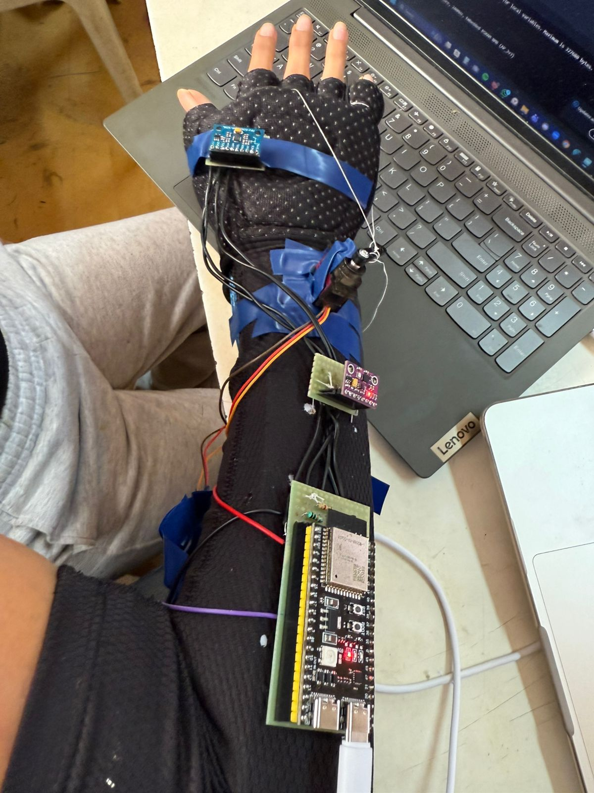
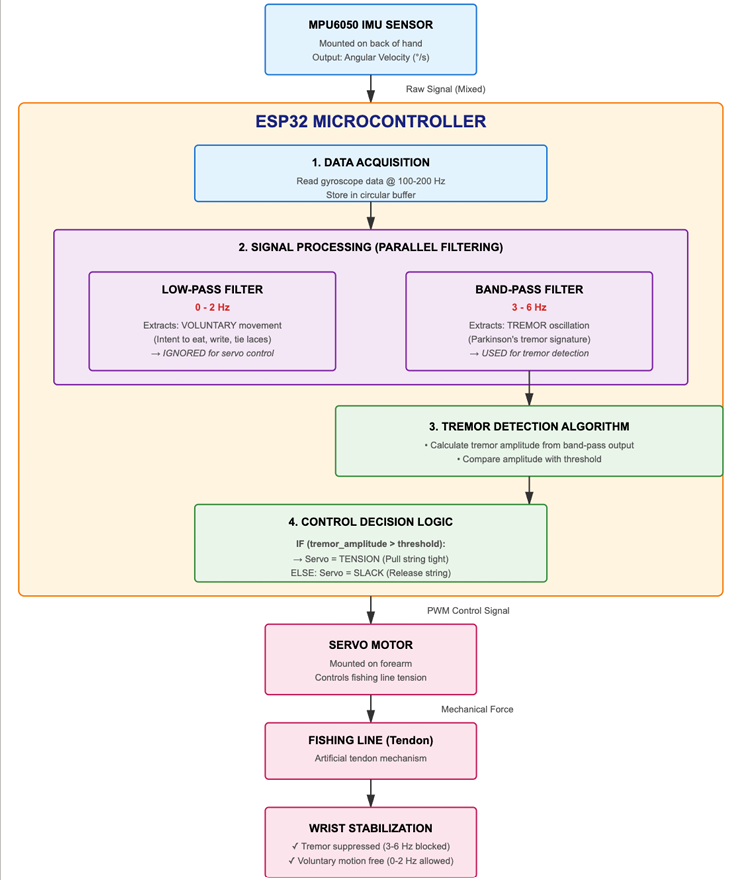

# Parkinson's Tremor Suppression Glove

  <i>Wearable prototype with real-time tremor monitoring and active stabilization</i>

> A wearable embedded system that detects involuntary hand tremors and provides active mechanical stabilization using dual IMUs, an ESP32, BLE communication, and a servo-driven tendon mechanism.

## Overview

Parkinsonian tremors make precise hand movements difficult during everyday tasks such as writing, eating, and holding objects. This project explores a low-cost wearable glove capable of detecting tremor-like wrist motion in real time and mechanically assisting hand stabilization.

Built during a **48-hour hackathon**, the prototype placed **6th out of 140 teams** at Tech-a-Thon (TSEC).

## System Architecture

The system combines dual inertial sensors, real-time processing on the ESP32, tremor detection, and mechanical actuation into a wearable feedback loop.

  

The sensing pipeline captures wrist and hand motion, processes the sensor data on the ESP32, evaluates tremor activity, and drives the servo-based tendon mechanism when stabilization is required.

## Features

- Dual **MPU9250 IMUs** for wrist and knuckle motion sensing
- **ESP32** real-time signal processing (~100 Hz sampling)
- Servo-driven tendon mechanism for active stabilization
- BLE-based **TremorLink** web dashboard for live monitoring
- Automatic tremor confirmation and release logic to reduce false activations

## Hardware

| Component | Purpose |
|-----------|---------|
| ESP32 | Main controller |
| 2× MPU9250 | Motion sensing |
| Servo Motor | Tendon actuation |
| BLE | Live data streaming |
| Compression Glove | Wearable platform |

## System Architecture

MPU9250 (Wrist) + MPU9250 (Knuckle) → ESP32 → Signal Processing → Tremor Detection → Servo Motor → Tendon Stabilization

## Results

- Functional wearable prototype completed in **48 hours**
- Real-time tremor monitoring through a BLE dashboard
- Active tendon stabilization demonstrated on a wearable glove
- **Rank 6 / 140 teams** at Tech-a-Thon 2026

## Future Work

- Adaptive band-pass filtering for improved tremor isolation
- TinyML-based personalized tremor classification
- Soft robotic actuators for quieter and more comfortable assistance

---

**Team Pink Pixels**  
*Rashi Bhayani · Vedanshi Mishra · Reina Doshi*
